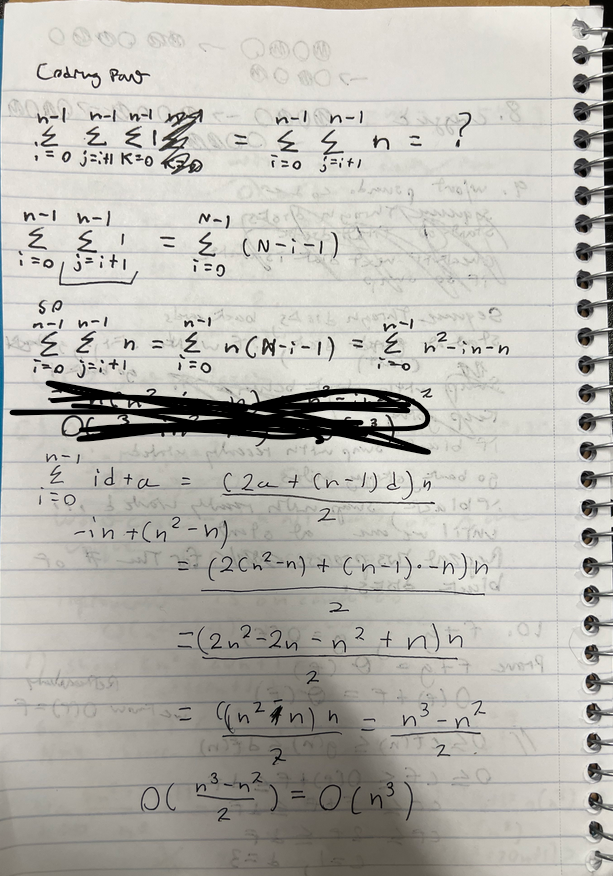
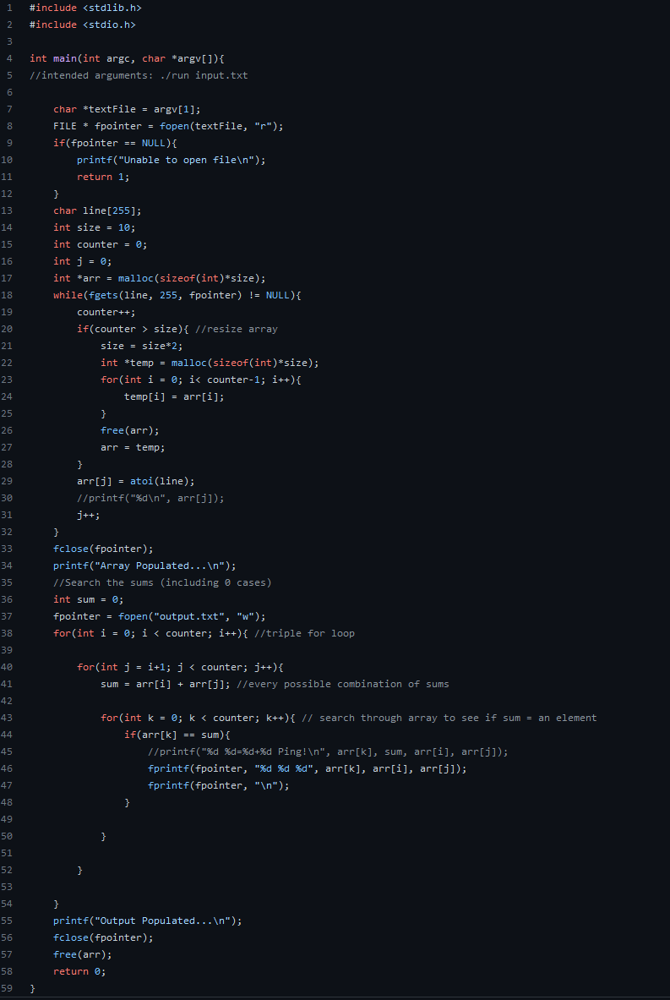
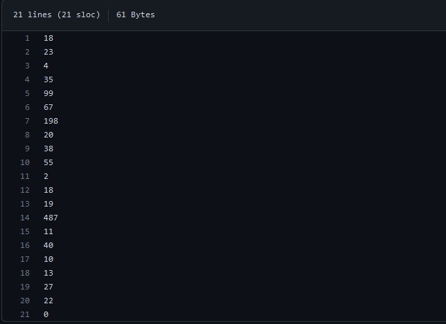
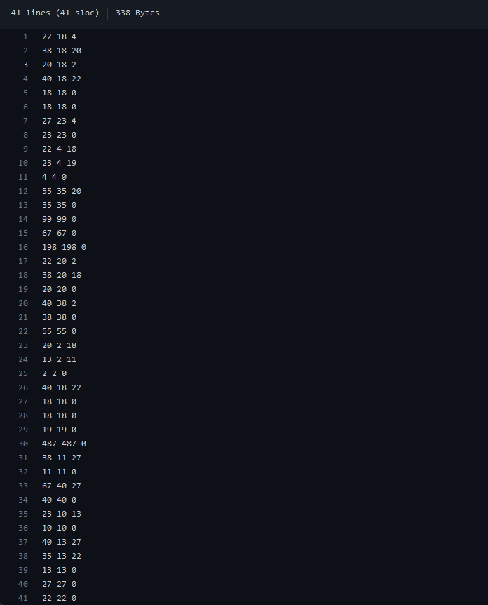

# 375-Warmup
Hello!
The warmup.c file is our main file.
Use "make" or "make all" to compile and the executable name will be run.
Intended input: ./run input.txt
Will output results in "output.txt" showing every combination of sum shared in the array.
**Extra Credit ^
**There will be an extra newline "\n" at the end of the outputfile, Professor Yin stated it was ok as long as I mentioned it here.
My input1.txt provides a large output.txt, specifically because of the 0 case.

Time Complexity:
My algorithm is slow, and the core of it is a triple for loop.
//We sequence through the array of ints, and then we sequence ahead again by + 1 getting every possible sum combination
//Everytime we get a possible sum we sequence to search the array of ints from + 0 to see if a sum matches an element
Big Oh (Worst Case)
O(n^3)

Image:
* 
***
Code:
* 
***
Input:
* 
***
Output:
* 
***
